# PyCharmのインストール（Windows）

コードを編集するエディタ、エディタでのコード補完機能、ショートカットによるプログラムの実行、デバッガによるデバッグ機能など、コーディングに必要な機能を１つにまとめたアプリを
**統合開発環境（IDE）** といいます。

**PyCharm** はJet
Brainsが開発するPython向けのIDEです。ここでは、PyCharmをWindowsにインストールする方法と簡単なプログラムの実行方法について紹介します。


ほかのエディタもあります！ [Visual Studio Code の紹介](../intro-vscode/doc.md)

## 手順

1. インストーラをダウンロードする
2. PyCharmのインストール

## 詳細

### 1. PyCharmインストーラをダウンロードする

PyCharmをインストールするためのインストーラを公式サイトからダウンロードして起動します。

公式サイトにアクセスします。

- https://www.jetbrains.com/ja-jp/pycharm/download/?section=windows

PyCharmにはエディションが2種類あります。

- PyCharm Professional：有料版
- PyCharm Community：無料版

一番最初に出てくるのは有料版です。下にスクロールすると無料のCommunity版があります。


「ダウンロード」をクリックします。

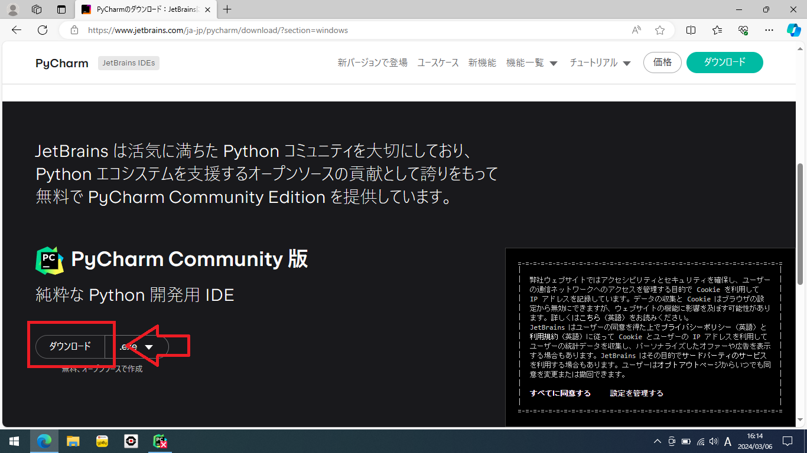

ダウンロードが完了したら、ブラウザによりますが、Edgeの場合は右上の「ファイルを開く」からインストーラを起動します。

> [!IMPORTANT]
> ここで画面全体の表示が切り替わって「このアプリがデバイスに変更を加えることを許可しますか？」と表示された場合は「はい」をクリックします。


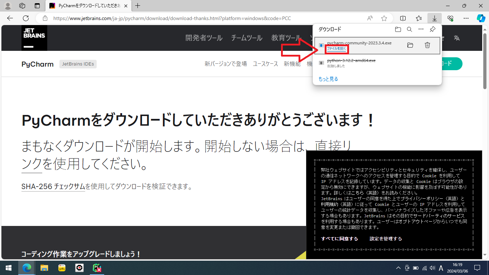

インストーラが起動します。

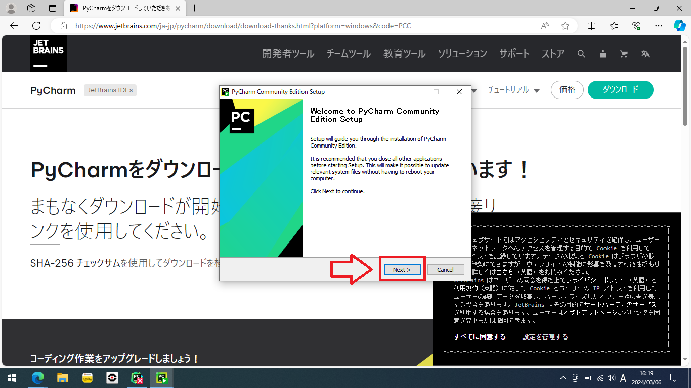

## 2. PyCharmのインストール

基本的には「Next >」（次へ）をクリックしていくだけです。


この画面では「Add "Open Folder as Project"」にチェックを入れておくと、フォルダを右クリックしてすぐにPyCharmで開くことができます（省略可）：

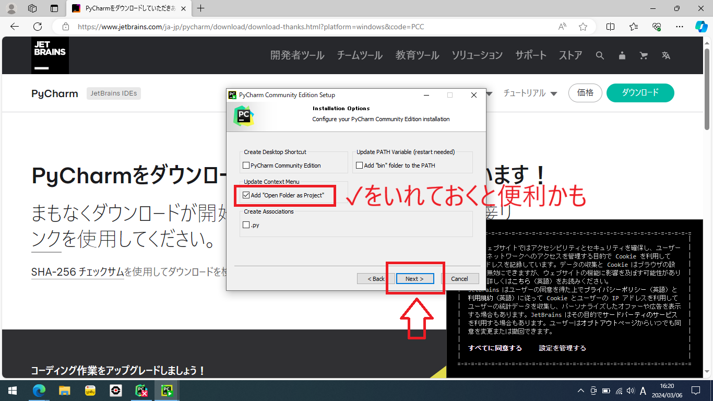
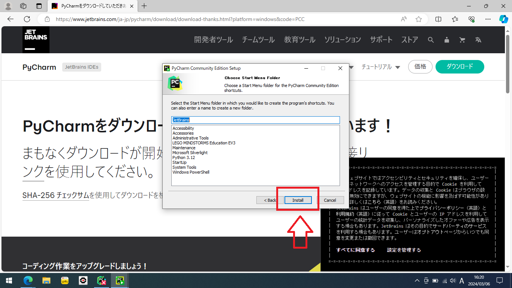

インストールが始まります。気長に待ちましょう。


インストールが完了したら「Finish」（終了）をクリックします。


# PyCharmでのコーディングとプログラムの実行

PyCharmでコードを書くには、 **プロジェクト**
というPythonスクリプトが入るフォルダを作成する必要があります。Pythonを書く`.py`
ファイルはこのプロジェクトのフォルダの中に作っていきます。新しいプログラムを作るときは、適当なプロジェクトを作りましょう。

## 手順

1. PyCharmの起動
2. プロジェクトの作成と初回のみのPythonの設定
3. コードを書いて実行

## 詳細

### 1. PyCharmの起動

①右下のWindowsアイコンをクリックしてWindowsメニューを開き、②「pycharm」と入力します。

PyCharmがインストールできていればPyCharmが見つかるはずです。

クリックしてPyCharmを起動しましょう。


起動中の画面：


> [!NOTE]
> PyCharmが起動したらWindowsのタスクバー（下のアプリのアイコンが並んでいるところ）にピン止めしておくと、毎回検索して起動しなくてよくなります。
>
> ピン止めするには起動したPyCharmのタスクバー上のアイコンを右クリックして「タスクバーにピン止めする」をクリックします。

初回の起動時のみ利用規約が表示されます。同意しないとPyCharmを利用できません。


下の「I confirm that I have...」（利用規約に同意します）にチェックを入れて「Continue」（続ける）をクリックします。

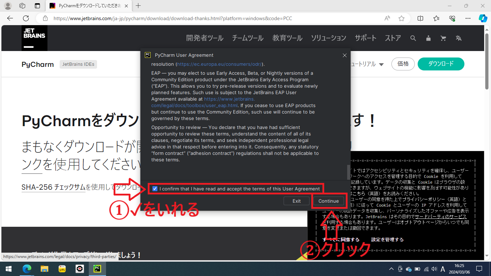

### 2. プロジェクトの作成と初回のみのPythonの設定

#### プロジェクトの設定

PyCharmのホーム画面です。「New Project」（新しいプロジェクト）でプロジェクトを作ります。

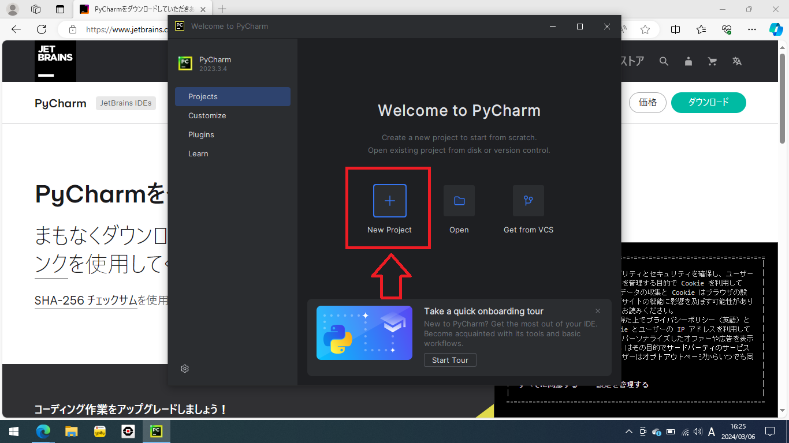

プロジェクトの初期設定です。これが少し厄介です。Pythonスクリプトを実行する環境がいろいろあるのですが、通常はコンソールでの実行と同じように、純粋な
**Pythonインタプリタ** で実行します。

1. まずは「Name:」（名前）にプロジェクト名を入力します。今から作るものの名前を入れましょう。今回は「Game1」としました。

2. 次に、「Interpreter type:」（インタプリタの種類）で「Custom environment」（カスタム環境）を選びます。

3. 最後に「Environment:」（環境）で「Select existing」（既存の環境を使う）を選びます。

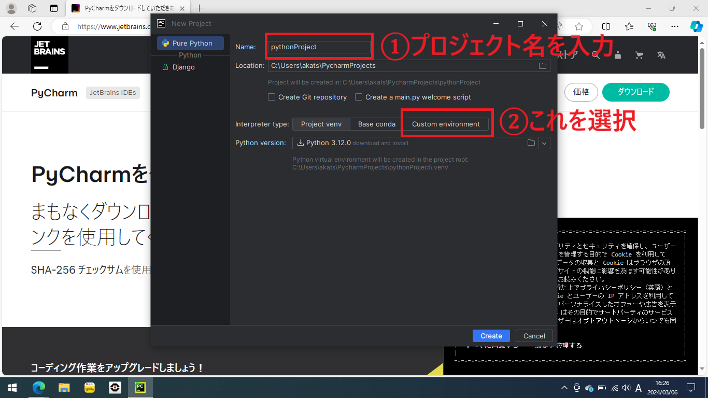


「Type:」（種類）は「Python」のままで、「Python path:」（Pythonインタプリタのパス）でインストールしたPythonを選びます。

ただ、 **なぜか最近のPyCharmは自動でインタプリタを検索してくれないので、初回のみ、自分でパスを入力する必要があります。
** （次回からは設定が残っているので自分で入力する必要はありません）

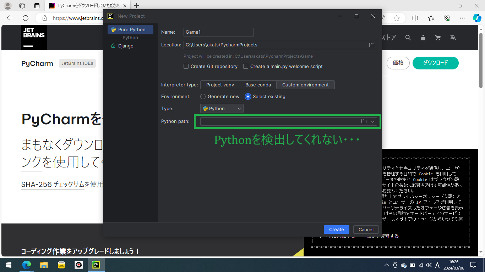

#### Pythonの初期設定（2回目からは省略可）

WindowsアイコンをクリックしてWindowsメニューを表示し、「python」と入力してPython本体を探します。インストールされていればPythonが見つかるはずです。

> [!IMPORTANT]
> Pythonが見つからない場合はPythonをインストールできていません。
>
> [コンソール上でのPythonスクリプトの実行](docs/how-to-run-python-cli/doc.md)
> を参考にしてPythonをインストールしてください。

Pythonを見つけたら、「ファイルの場所を開く」をクリックします。


ここで表示されるPythonは本体のファイルではなくショートカットなので、本体のパスを調べます。

「Python X.XX (XX-bit)」を右クリックしてプロパティをクリックします。

名前が違ければ同じようなアイコンのファイルを右クリックしてください。


「ショートカット」のタブを選んで、「リンク先(T)：」にあるPythonの本体のパスをコピーします。

- 「リンク先(T)：」の入力欄をクリックして、「Ctrl+A」（全選択）、「Ctrl+C」（コピー）を行います。これでPythonのパスがコピーできたはずです。


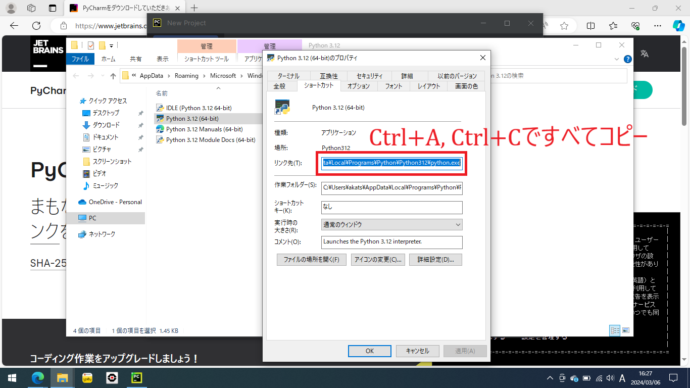

PyCharmに戻り、「Python path:」（Pythonインタプリタのパス）の入力欄の右にあるフォルダアイコンをクリックします。


上部の入力欄の内容をすべて消して「Ctrl+V」（貼り付け）を入力し、コピーしたPythonのパスを貼り付けます。貼り付けられないときはもう一度パスのコピーからやり直してください。

貼り付けられたら「OK」をクリックします。


エラーが出なければPython本体の設定は成功です！

#### プロジェクトの作成 完了

「Create」（プロジェクトの作成）をクリックします。

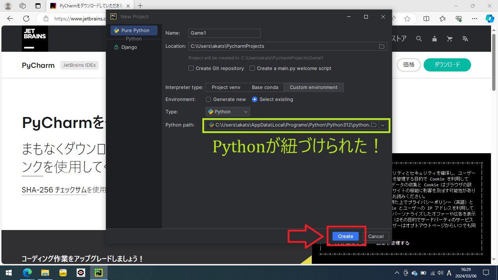

### 3. コードを書いて実行

プロジェクトが読み込まれます：


これでPyCharmのエディタが起動します。

右下に「Microsoft Defender Configuration」が表示されたら「Automatically」をクリックしておきましょう。

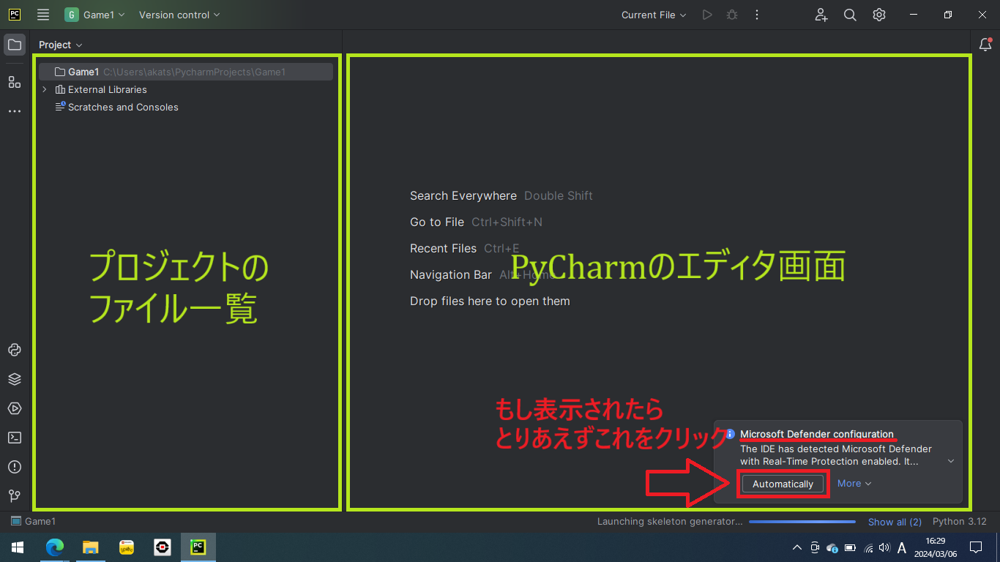

プロジェクトにコードを書く`.py`ファイルを作成します。

プロジェクトのフォルダを右クリックして「New」（新規）から「Python File」（`.py`ファイル）をクリックします。

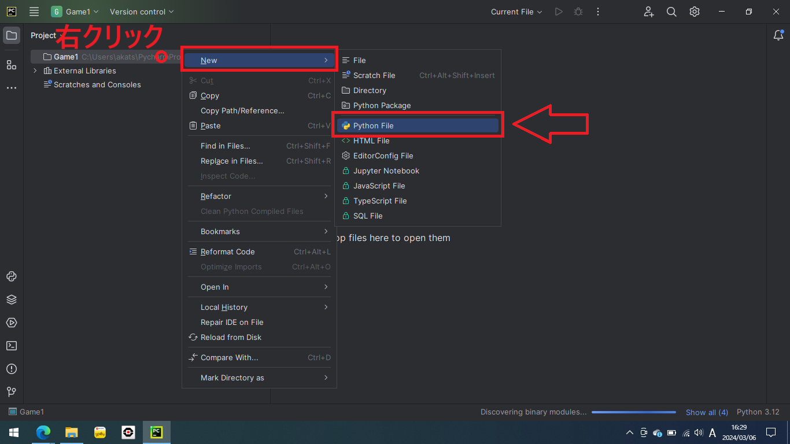

そのままの状態でファイル名を入力します。今回は「main.py」を作ろうと思うので、「main」と入力してください。このとき、「.py」の部分を入力する必要はありません。

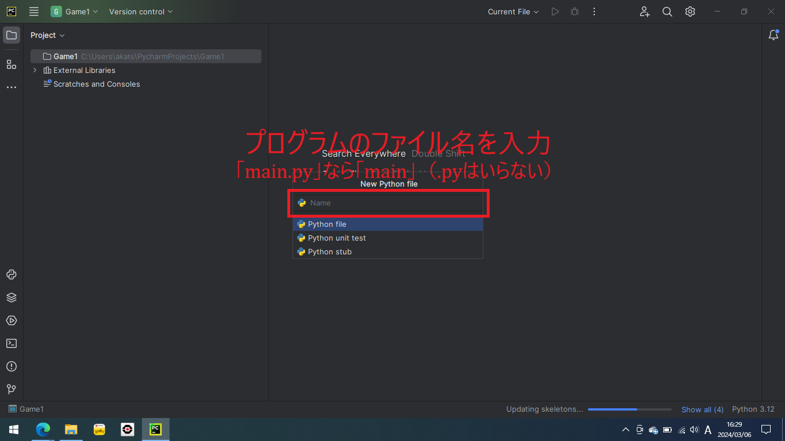


ファイル「main.py」が作られ、「main.py」の編集画面が表示されます。

試しに次のサンプルプログラムを入力してみましょう。

```python
print("Hello, World!")
print(2 ** 100)
```

- サンプルプログラムの１行目は「Hello, World!」と出力するプログラムです。
- サンプルプログラムの２行目は2の100乗を計算して出力するプログラムです。


コードが書けたら、上の実行ボタンをクリックします。

すると、下に実行結果が表示されます。

実行のショートカットは「Shift+F10」ですが、これは設定のKeymapで変更することができます。

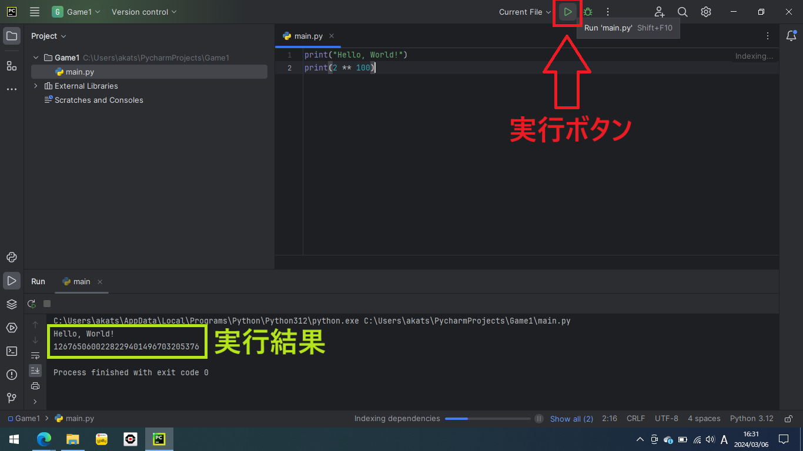

プロジェクトを閉じるときは「File」（ファイル）から「Close Project」（プロジェクトを閉じる）をクリックします。


プロジェクトが閉じて、ホーム画面に戻ります。

作ったプロジェクトをクリックすれば、またプロジェクトを開けます。

新しいプロジェクトを作る場合は「New Project」をクリックしてください。

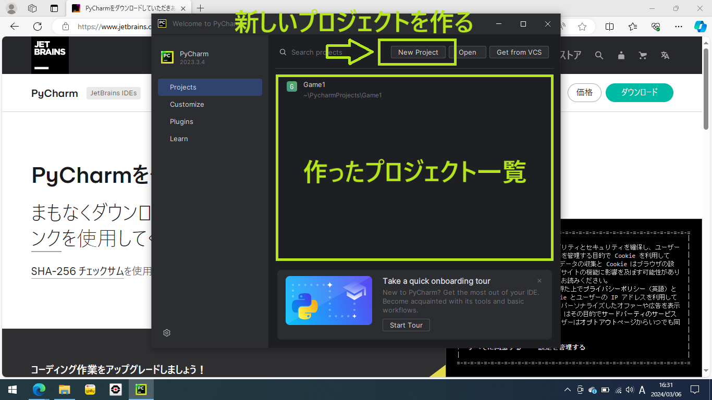

[//]: # (![img]&#40;./scr34.png&#41;)


