# Pythonのインストール（Windows）

## Python本体のインストール

Python公式サイト https://www.python.org にアクセスします。

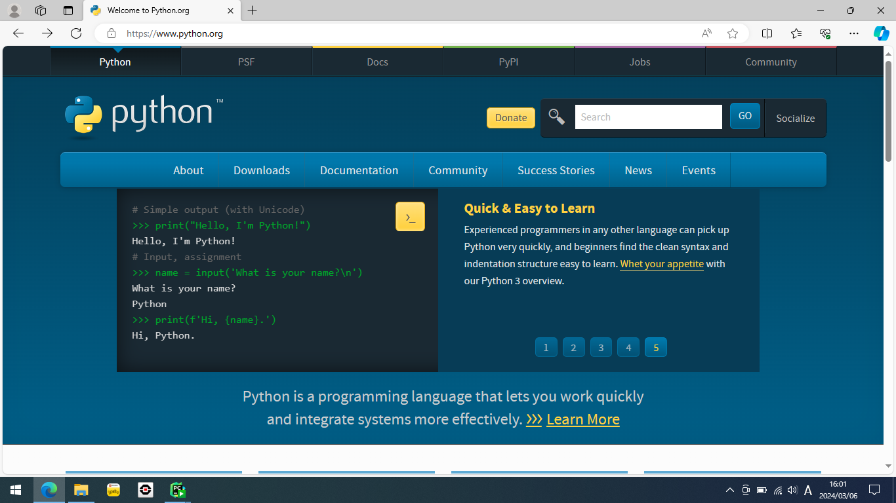

下にスクロールして「Download」（ダウンロード）のところにある「Latest」（最新版）のリンクにアクセスします。

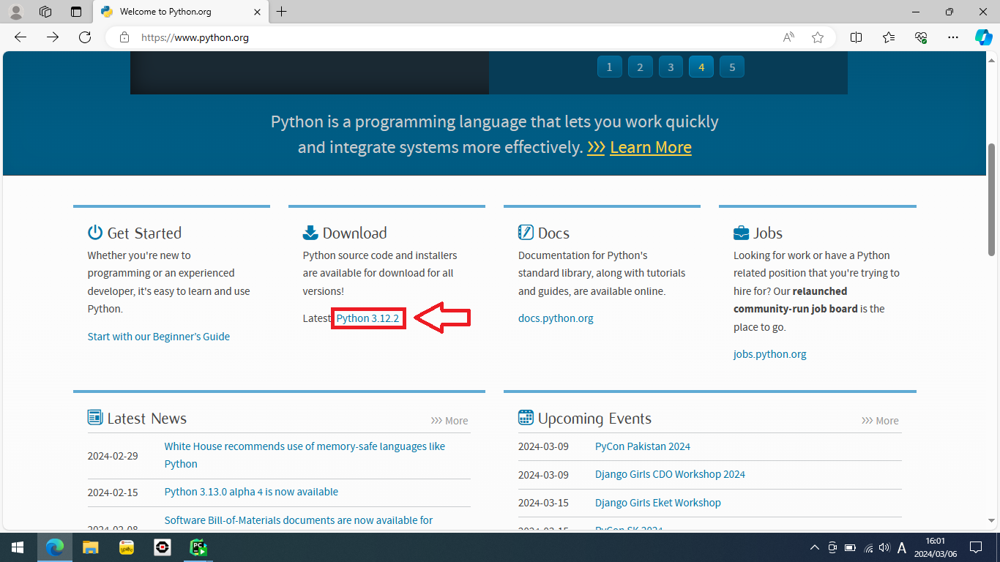

最新版の情報のページに移動します。

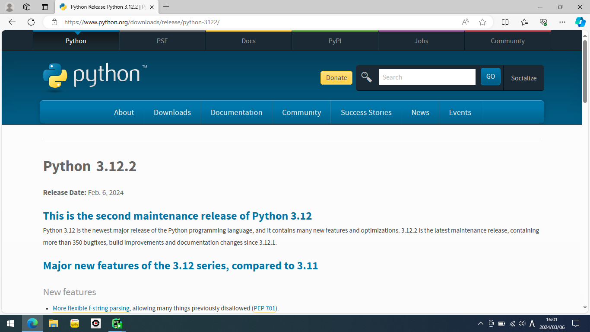

下にスクロールして「Windows Installer (64-bit)」をクリックします。インストーラのダウンロードが始まるので完了するまで待ちます。

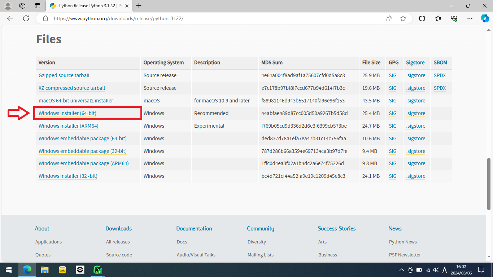

ダウンロードしたインストーラを実行します。

ダウンロード結果の表示はブラウザによって異なりますが、Edgeの場合は上部にダウンロード結果が表示されるので、「ファイルを開く」から実行できます。

> [!NOTE]
> インストーラの起動には少し時間がかかるかもしれないので、「ファイルを開く」をクリックしたら少し待ちましょう。

> [!IMPORTANT]
> ここで画面全体の表示が切り替わって「このアプリがデバイスに変更を加えることを許可しますか？」と表示された場合は「はい」をクリックします。


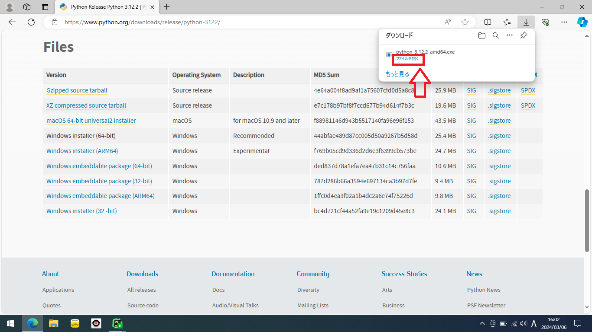

インストーラが起動します。

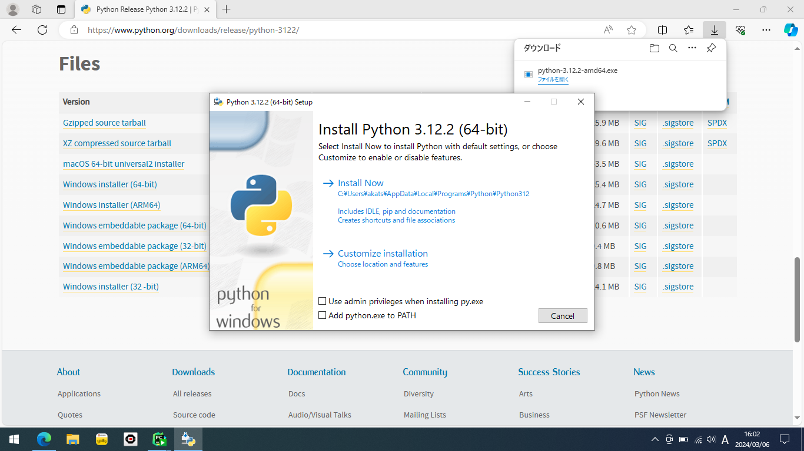

①「Add python.exe to PATH」（PythonのPATHを通す）にチェックを入れ、②「Install Now」（そのままインストール）をクリックします。

> [!WARNING]
> ここで①「Add python.exe to PATH」にチェックを入れ忘れるとコンソールからPythonが起動できなくなります！！！

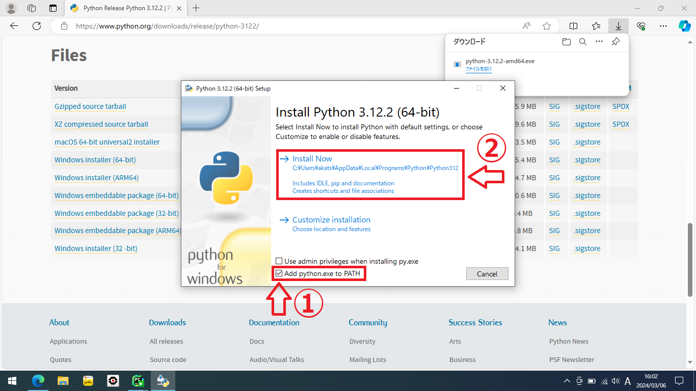

インストールが進んでいきます。

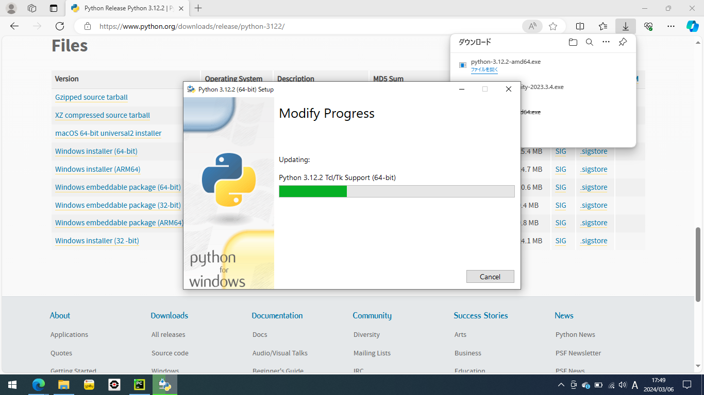

画面が切り替わればインストール完了です！「Close」（閉じる）でインストーラを終了します。

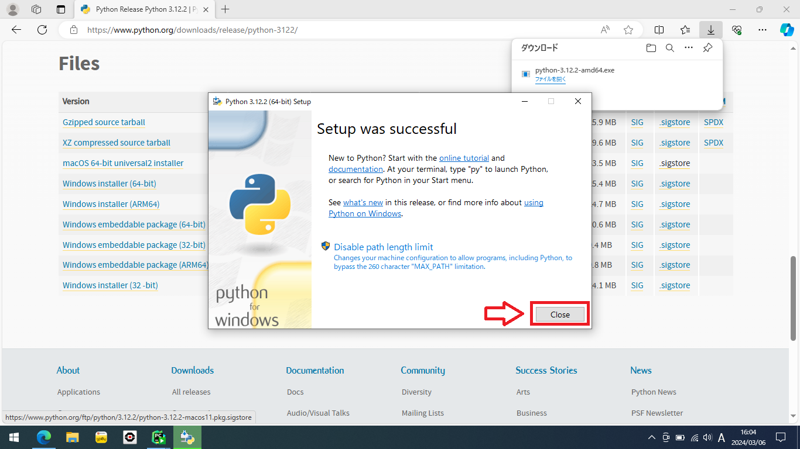

## Pythonの動作確認

コンソール（コマンドプロンプト）を起動します。

左下のWindowsアイコンをクリックしてWindowsメニューを開き、②検索バーに「cmd」と入力します。

> [!TIP]
> コマンドプロンプトとは、コマンドで指示を与えるとその指示に従って処理をした結果が出力されるシステムです。

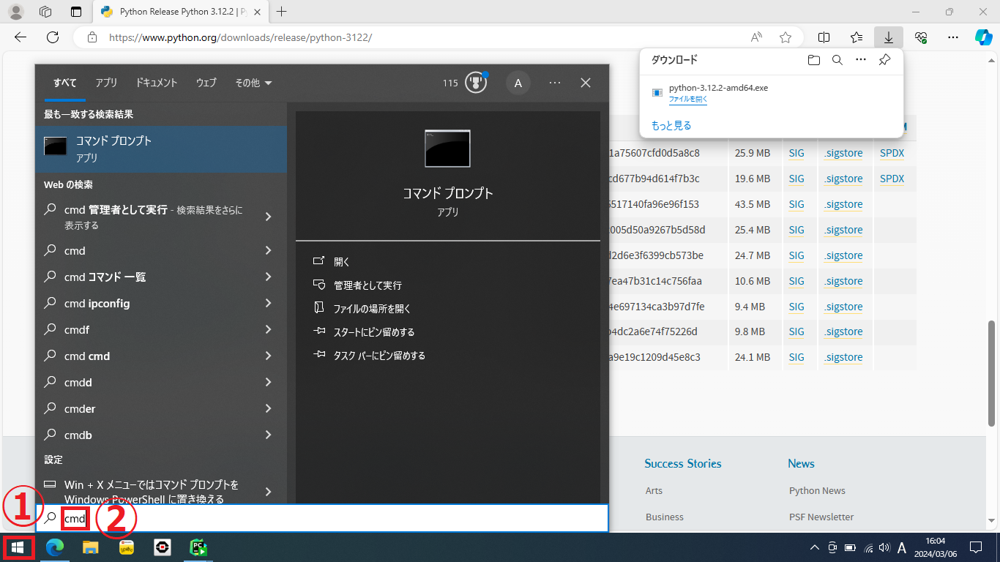
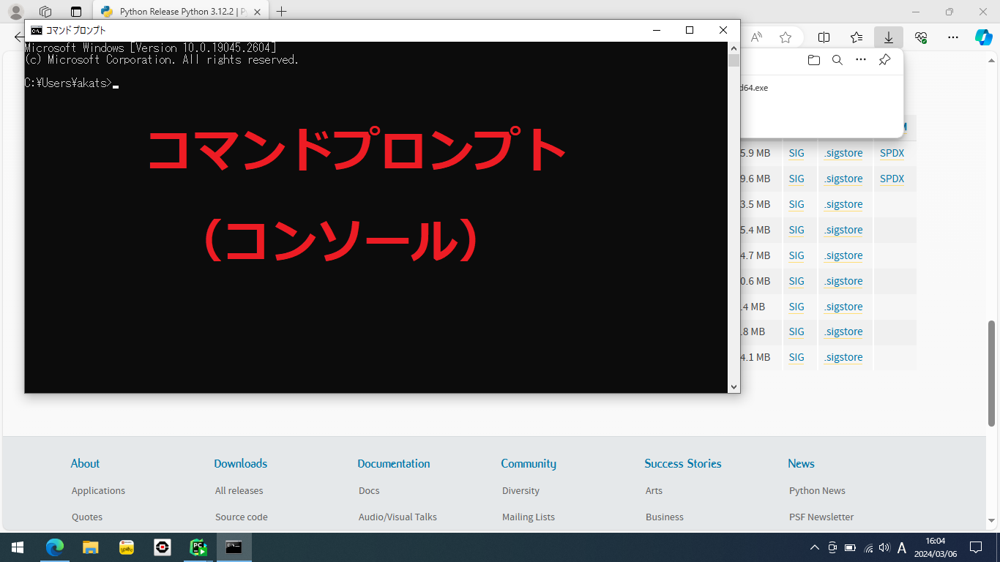

次のコマンドを実行してPythonのバージョンを確認できます。

```commandline
python --version
```


次のコマンドを実行してPythonをコンソール上で実行できます。

```commandline
python
```

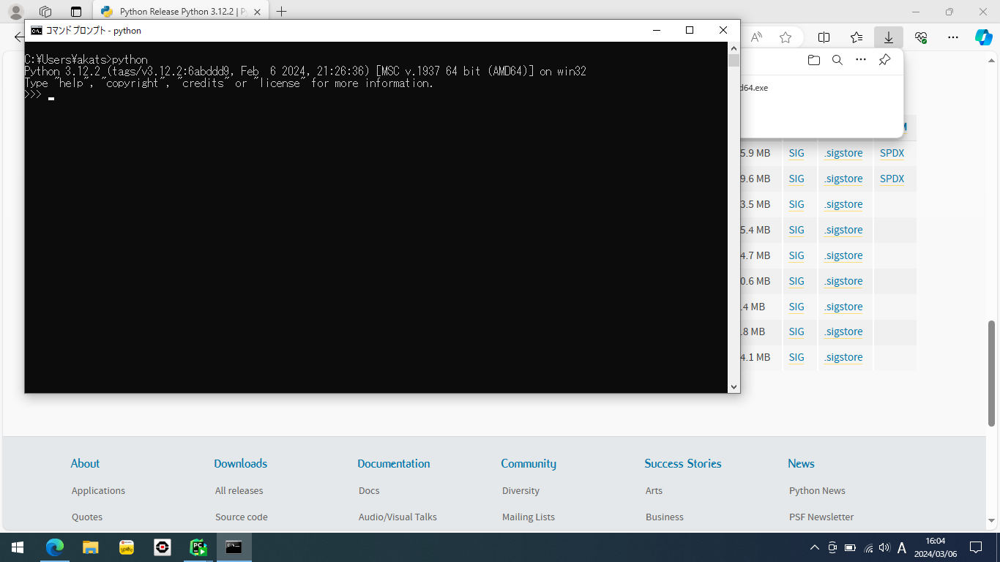

> [!TIP]
> コマンド`python`をコンソールで実行すると対話モードのPythonが起動します。
> 
> 対話モードとは、コマンドプロンプトのように、入力したPythonコード１行１行に対して処理結果が出力されるモードです。

- 通常のアプリケーションのようにファイルに書いたスクリプトを一気に実行する場合は、「.py」
  ファイルを作成し、`python`コマンドに続けてそのファイルパスを指定してください。

次のコマンドを実行してPythonに数式（2の100乗）を評価させてみましょう。

```python
2 ** 100
```


対話モードのPythonを終了するには次のコマンドを実行します。

```python
exit()
```