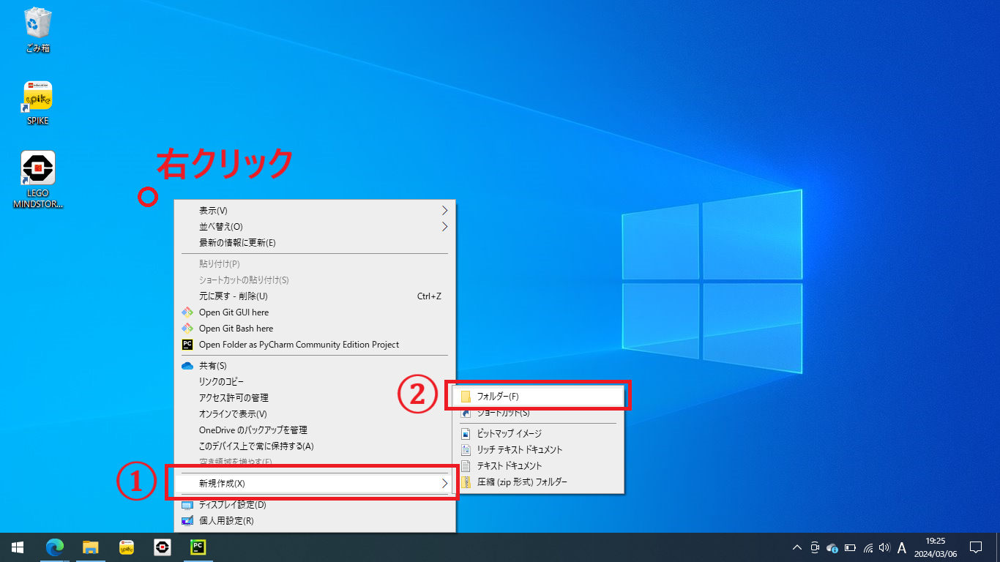
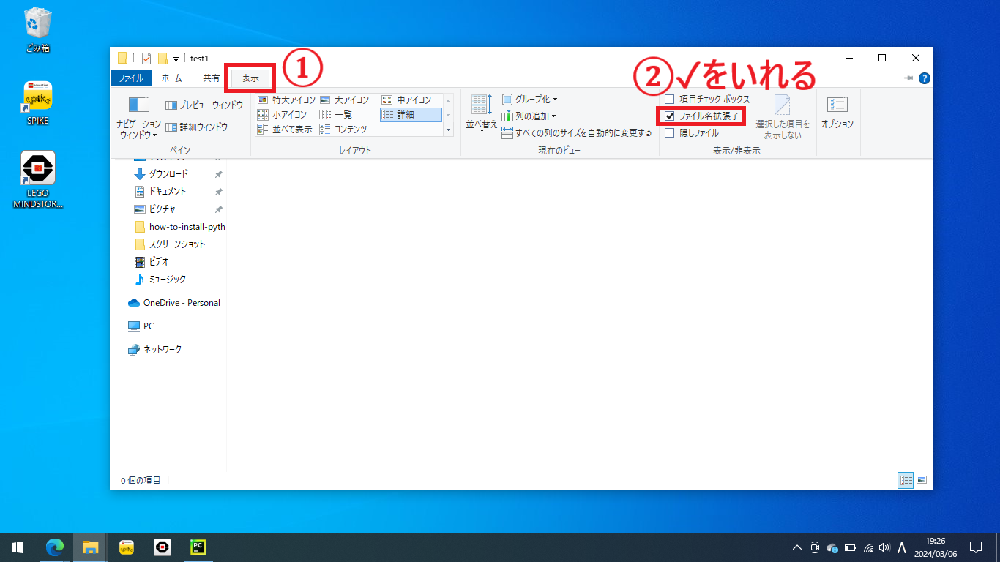
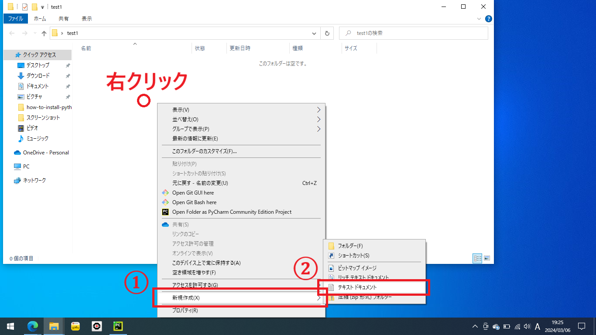
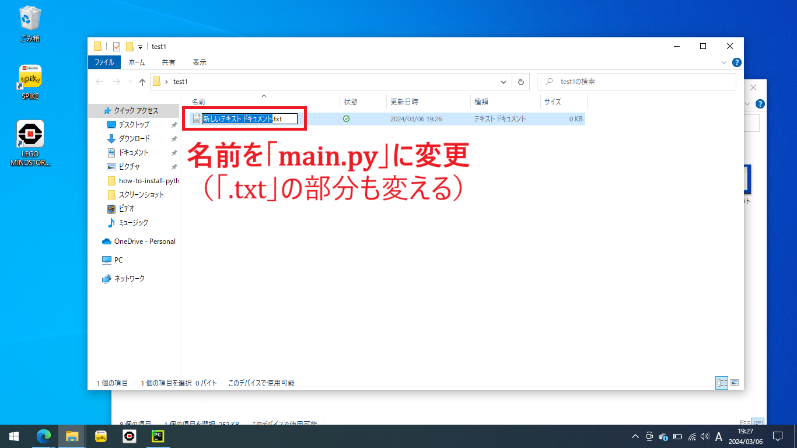
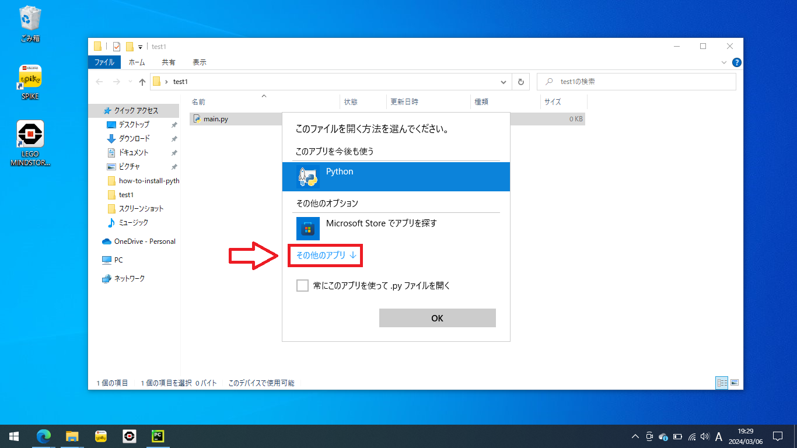
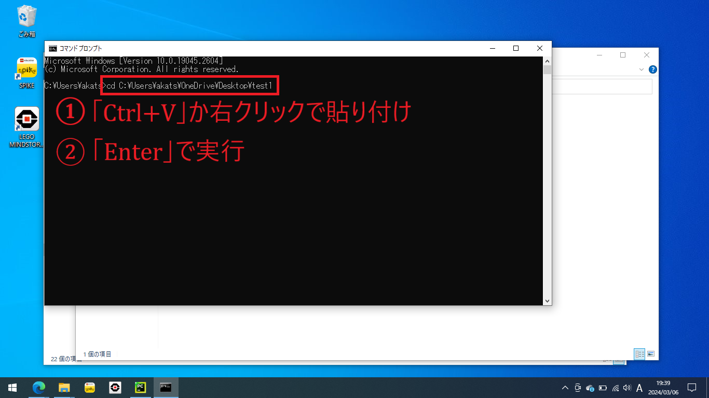

# コンソール上でPythonスクリプトを実行する方法（Windows）

コンソール（コマンドプロンプト、ターミナル）はコマンドを入力してプログラムを実行するシステムです。

ここではPythonスクリプトを配置、編集、コンソール上で実行する方法を紹介します。

> [!TIP]
> コンソールでの実行は最も原始的なPythonの実行方法です。
>
> コンソールはどのOSでも標準で搭載されているので、Python本体以外にアプリをインストールしなくてもPythonスクリプトを実行することができます。

> [!TIP]
> Python標準のIDE[^1]であるIDLEや、より高級なIDEであるPyCharmなども、裏でコンソールコマンドを動かすことでPythonスクリプトを実行しています。

[^1]: [統合開発環境](../how-to-install-pycharm/doc.md)

Windowsのコマンドプロンプト：


## 手順

1. Pythonスクリプトを格納するフォルダを作る（省略可）
2. フォルダの中にPythonスクリプトを記述する`.py`ファイルを作る
3. 2で作った`.py`ファイルにプログラムを書く
4. コンソール上のコマンド`cd <フォルダ名>`で、1で作ったフォルダ[^1]にカレントディレクトリを移動する
5. コンソール上のコマンド`python <.pyファイル名>`で、2で作った`.py`ファイルを実行する

[^1]: 1でフォルダを作っていない場合は実行する`.py`があるフォルダ

## 詳細

### 1. スクリプトを配置するフォルダを作る

今回はデスクトップに`test1`というフォルダを作りましょう。（もちろんほかの場所でもかまいません）

デスクトップ上で右クリックし、「新規作成」から「フォルダー」をクリックします。



フォルダに名前をつけます。`test1`としておきましょう。


### 2. Pythonスクリプトを書くファイルを作る

次に、フォルダ`test1`にPythonスクリプト`main.py`を作成します。

さきほど作ったフォルダ`test1`を開きます。

今の状態ではフォルダの中身は空です：


ここで、ファイル`main.py`を作るときに拡張子`.py`の部分を編集できるように、拡張子を表示する設定に変更します。

（このステップは１度設定したことがあれば２回目以降はスキップできます）

- 上部の「表示」から「ファイル名拡張子」にチェックを入れます
  

ファイルを作ります。右クリックして「新規作成」から「テキストドキュメント」をクリックします。



ファイル名を編集します。このとき、**拡張子`○○.txt`の部分を`○○.py`に変更する必要があります** 。

名前をすべて選択して、ファイル名を`main.py`としてください。



ファイル`main.py`作成後：


> [!IMPORTANT]
> ファイル名が`main.py.txt`となっている場合は拡張子部分の変更ができていません！

### 3. プログラムを書く

`main.py`にプログラムを書きます。

> [!NOTE]
> `.py`ファイルはダブルクリックで開くと、プログラムとして実行されてしまい編集ができません。
>
> 右クリックから「プログラムから開く」でメモ帳などのテキストエディタで開くと編集することができます。

右クリックから「プログラムで開く」をクリックします


「その他のアプリ」をクリックします



今回は「メモ帳」で開きます。メモ帳はWindows標準のテキストエディタです。

> [!TIP]
> メモ帳は正直プログラミング用のエディタにはあまり向いていません。
>
> よく使われているエディタとしては[Visual Studio Code](https://code.visualstudio.com)などがあります。


メモ帳で`main.py`を開いたもの：


サンプルプログラムとして次のプログラムを入力してみましょう。

```python
for i in range(10):
    print(i)
```

-

> [!NOTE]
> このプログラムは0から9までの数字を１行ずつ表示するプログラムです。
>
> 2行目の頭の大きな空白はインデントといい、キーボード左端の「Tab」キーで入力できます。
> スペース2つやスペース4つでもかまいませんが、常に同じ数のスペースを使う必要があります。

> [!TIP]
> タブの幅はエディタによって変わるので見る人によってソースコードの見た目が変わる問題があります。
>
> より高機能なテキストエディタを使うと、見た目の変わらないスペースにタブが自動変換されます。

プログラムが完成したら「Ctrl+S」（Ctrlキーを押してからCtrlキーを離さずにSを押す）で保存します。

メモ帳上部の「ファイル」から「上書き保存」でも保存できます。

> [!NOTE]
> 念のためこの時、メモ帳右下端に「UTF-8」[^2]
> と表示されていることを確認してください。
>
> もしも文字コードが異なる場合、メモ帳上部の「ファイル」から「名前を付けて保存」をクリックし、表示された画面下部の「文字コード」で「UTF-8」を指定します。

[^2]: Pythonスクリプトは常に「UTF-8」の文字コードで保存する必要があります。「UTF-8」はインターネット等でも一般的に使用されている有名な文字コードです。しかしながら、Windowsでは長い間Shift-JIS（CP932）という文字コードを使用してきた経緯があり、もしかしたら「UTF-8」でないことがあるかもしれません。


### 4. コンソールの起動とカレントディレクトリの設定

コンソール（コマンドプロンプト）を起動します。

コマンドプロンプトの起動方法は[Pythonインストール方法](../how-to-install-python/doc.md#pythonの動作確認)
の「Pythonの動作確認」で最初に説明しています。


カレントディレクトリをフォルダ`test1`に移します。

> [!TIP]
> カレントディレクトリを移す手順はコマンドプロンプトを起動したときだけ必要です。
> 連続してプログラムを動かすときは不要です。

次のコマンドを動かします。

```commandline
cd <Pythonスクリプトがあるフォルダへのパス>
```

まず「cd 」（cとdとスペース）を入力してください。 `cd`のあとにスペースを忘れずに！


フォルダ`test1`の画面に移ります。


上のアドレスバーをクリックするとフォルダ`test1`までのパスが選択されます。

このパスを「Ctrl+C」でコピーします。


コンソール画面に戻ります


「Ctrl+V」もしくは右クリックでコピーしたパスを貼り付けます

> [!TIP]
> ふつう貼り付けのショートカットは「Ctrl+V」ですが、コンソール上では右クリックでも貼り付けられます。



「Enter」を押して、`cd`コマンドを実行します。

カレントディレクトリが移動すると、コマンドを入力する`>`
よりも左側に書いてあるパスが変わります。これが`.py`ファイルがあるフォルダのパスになれば成功です。


> [!TIP]
> カレントディレクトリのファイルの一覧を表示するコマンドは`dir`です。
> `dir`コマンドを実行すると`main.py`が表示されるはずです。

### 5. コンソールでの`.py`ファイルの実行

コマンド`python main.py`で`main.py`を実行します。


書いたプログラムの通り実行されたら成功です！


