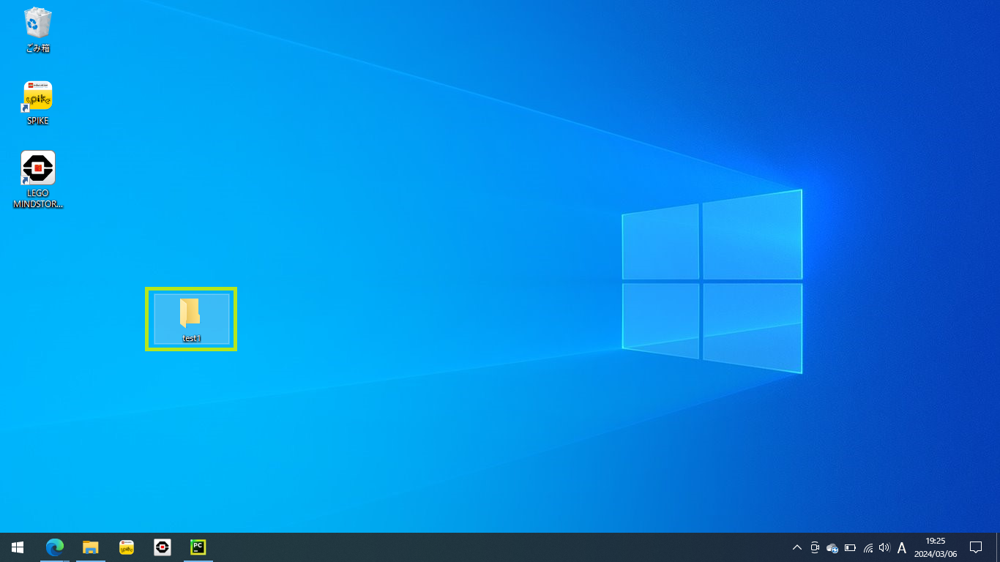
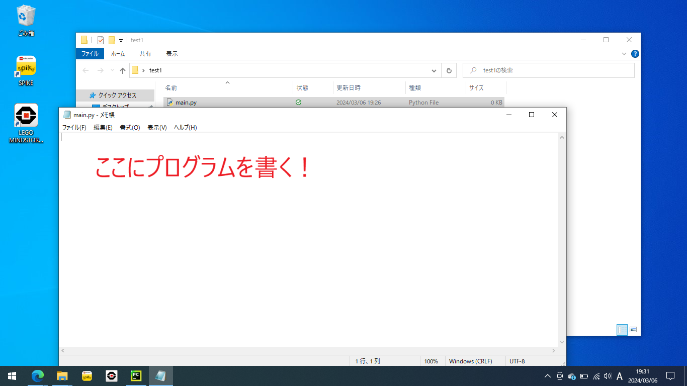
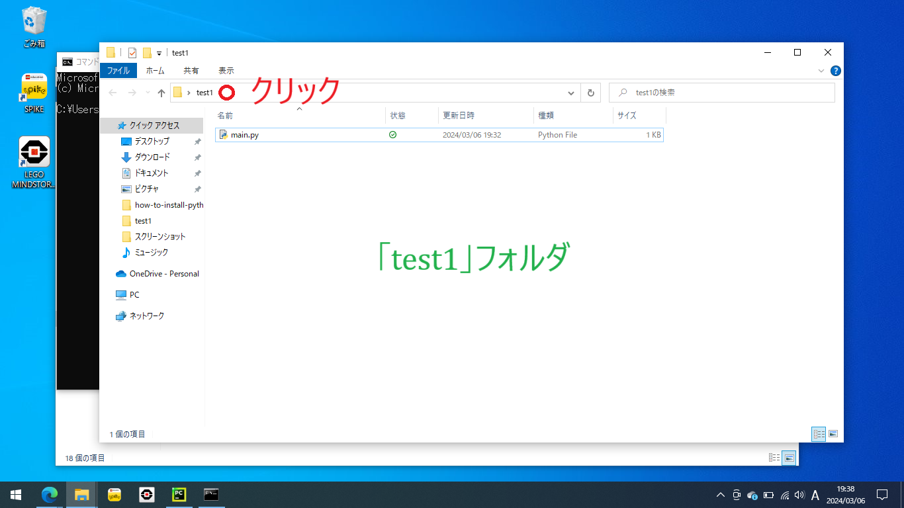

# コンソール上でPythonを実行する方法

ここではPythonスクリプトを配置、編集、コンソール上で実行する方法を紹介します。

1. スクリプトを配置するフォルダを作ります。今回はデスクトップに「test1」というフォルダを作りましょう。（もちろんほかの場所でもかまいません）

- デスクトップ上で右クリックし、「新規作成」から「フォルダー」をクリックします。
  
- フォルダに名前をつけます。「test1」としておきましょう。
  

2. 次に、フォルダ「test1」にPythonスクリプト「main.py」を作成します。

- 先ほど作ったフォルダ「test1」を開きます。
  
- 今の状態ではフォルダの中身は空です：
  
- ※ここで、ファイル「main.py」を作るときに拡張子「.py」の部分を編集できるように、拡張子を表示する設定に変更します。
- 拡張子を表示するには、上部の「表示」から「ファイル名拡張子にチェックを入れます」
    - このステップは１度設定したことがあればスキップできます。
      
- ファイルを作ります。右クリックして「新規作成」から「テキストドキュメント」をクリックします。
  
- ファイル名を編集します。このとき、**拡張子「○○.txt」の部分を「○○.py」に変更する必要があります**
  。名前をすべて選択して、ファイル名を「main.py」としてください。
  
- ファイル「main.py」作成後：（ファイル名が「main.py.txt」となっている場合は拡張子部分の変更ができていません！）
  

3. 「.py」ファイルはダブルクリックで開いてしまうとプログラムとして実行されてしまい、編集ができません。右クリックから「プログラムから開く」でメモ帳などのテキストエディタで開くと編集することができます。

- 右クリックから「プログラムで開く」をクリックします
  
- 「その他のアプリ」をクリックします
  
- 今回は「メモ帳」で開きます。メモ帳はWindows標準のテキストエディタです。
    - 正直プログラミングにはあまり向いていません。
    - よく使われているエディタとしては Visual Studio Code などがあります。興味があれば調べてみてください。
      
    - メモ帳で「main.py」を開いたもの：
      

4. サンプルプログラムとして次のプログラムを入力してみましょう。

- サンプルプログラムは0から9まで１行ずつ表示するプログラムです。
- 2行目の頭の大きな空白はインデントといい、キーボード左端のTabキーで入力できます。スペース2つやスペース4つでもかまいませんが、常に同じ数のスペースを使う必要があります。

```python
for i in range(10):
    print(i)
```

5. プログラムが完成したら「Ctrl+S」（Ctrlキーを押してからCtrlキーを離さずにSを押す）で保存します。

- メモ帳上部の「ファイル」から「上書き保存」でも保存できます。
- 念のためこの時、メモ帳右下端に「UTF-8」と表示されていることを確認してください。「UTF-8」は文字コードの一種で、PythonスクリプトはUTF-8の文字コードで保存する必要があります。
    - もしも文字コードが異なる場合、メモ帳上部の「ファイル」から「名前を付けて保存」をクリックし、表示された画面下部の「文字コード」で「UTF-8」を指定します。


6. コンソール（コマンドプロンプト）を起動します。

- コマンドプロンプトの起動方法は[Pythonインストール方法](../how-to-install-python/doc.md)の「Pythonの動作確認」で最初に説明しています。
  

7. カレントディレクトリをフォルダ「test1」に移します。

- 「cd 」（cとdとスペース）を入力してください。（cdのあとにスペースを忘れずに！）
  
- フォルダ「test1」の画面を開きます。
  
- 上のアドレスバーをクリックするとフォルダ「test1」までのパスが選択されます。このパスを「Ctrl+C」でコピーします。
  
  
  
  
  
  ![img](./scr21.png
  
