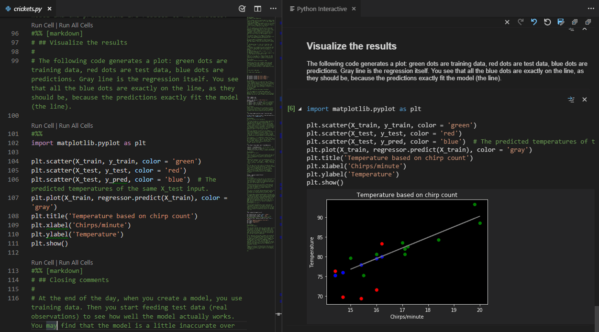

# Visual Studio Code の紹介

PyCharmは使用するパソコンのスペックによってはすこし重たいのが難点です。
Pythonで開発する人がよく使うエディタには主にPyCharmと[Visual Studio Code](https://code.visualstudio.com)
（VS Code）
があり、VS
Codeを使ったほうが快適な場合もあります。

Python用のエディタ（コードの編集をするアプリ）として使う分には、メモ帳に比べればVS Codeで十分です。
VS CodeをただのエディタとしてPythonプログラムを組むときは、VS
Codeでプログラムを編集し、「[コンソール上でPythonスクリプトを実行する方法](docs/how-to-run-python-cli/doc.md)」
で紹介した方法で付属のターミナル上でプログラムを実行することになります。

ただ、VS CodeはPython専用のエディタではありません。
VS CodeをPyCharmと同じくらい高機能にセットアップするには、最初にプラグインをインストールして適切に設定をするなどの難易度の高い手間があります。

VS Code：公式サイトより https://code.visualstudio.com/docs/languages/python

